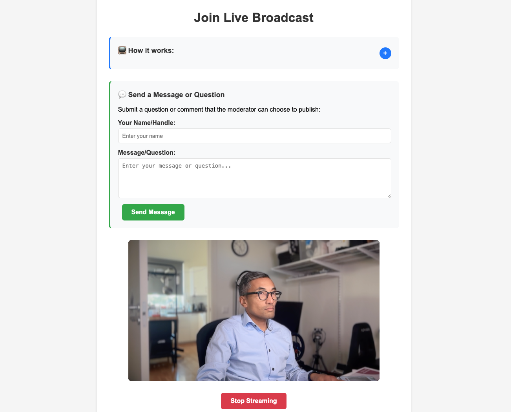

# Join Live

[](https://opensource.org/licenses/Apache-2.0)
[](https://nodejs.org)
[](https://docker.com)

A comprehensive web application for live broadcasting that enables participants to join live streams via WHIP (WebRTC-HTTP Ingestion Protocol) with a professional editor interface for stream management and OBS Studio integration.

## Screenshots

### Participant Interface
<div align="center">
  
  <p><em>Desktop participant interface with camera preview and broadcasting controls</em></p>
</div>

<div align="center">
  
  <p><em>Mobile-responsive participant interface</em></p>
</div>

### On-Air Status
<div align="center">
  
  <p><em>Real-time on-air indicator when participant is selected in editor</em></p>
</div>

### Editor Interface
<div align="center">
  
  <p><em>Professional editor interface with numbered stream mosaic and active output selection</em></p>
</div>

## Features

### 🎥 **Participant Broadcasting**
- 📹 Camera preview with automatic permission handling
- 🔴 One-click live broadcasting via WHIP
- 📱 Responsive design for desktop and mobile
- 🎛️ Real-time status updates
- ✨ Real-time on-air indicator when selected in editor

### 💬 **Participant Messaging System**
- 📝 Submit questions and comments without joining broadcast
- 🔍 Moderator queue for reviewing and approving messages  
- ✅ Real-time message approval/rejection workflow
- 📺 Clean messages feed optimized for OBS overlay
- 💌 Editor can send broadcast messages to all participants

### 🎛️ **Professional Editor Interface**
- 📺 Numbered stream mosaic view
- ⌨️ Keyboard shortcuts (1-9, 0) for instant stream selection
- 🔄 Real-time synchronization across all devices
- 📊 Live stream monitoring and management
- 💬 Integrated message moderation system
- 🔔 Audio notifications for participant joins (configurable)
- 📋 Comprehensive participant instructions display

### 👥 **Side-by-Side Broadcasting** *(NEW)*
- 🎭 **Multi-Participant Selection**: Shift+click to select up to 2 participants
- 📺 **Dual Stream Output**: Side-by-side video layout for paired broadcasting
- 🔄 **Smart Take Button**: Context-aware "Take Selected" with single/dual mode
- 🔴 **Untake Toggle**: Easy on/off air control with visual feedback
- ⚡ **Countdown Support**: Optional countdown for both single and dual selections

### 💬 **Participant-to-Participant Communication** *(NEW)*
- 🎥 **Real-time Video Chat**: Selected participants see each other's live feeds
- 🖼️ **Smart Layout**: Partner video in main area, self-preview in corner
- 🔄 **Automatic Pairing**: Instant communication when editor selects participants
- 🎯 **Visual Indicators**: Clear "Partner" and "You" labels for identification
- 📺 **Seamless Integration**: Works alongside side-by-side broadcast output

### 🎮 **OBS Studio Integration**
- 🖥️ **Screen/Window Capture**: Capture participant video feed for broadcast output
- 👥 **Side-by-Side Output**: Dual participant layout with 50/50 split screen *(NEW)*
- 🌐 **Browser Source**: QR code display (`/qr`) for easy participant joining
- 💬 **Messages Feed**: Live messages overlay (`/feed`) for audience interaction
- 🔄 Automatic stream switching based on editor selection (single or dual)
- 📡 Real-time updates via WebSocket
- ⚫ Black background video output with QR code when no participants selected

### 🔧 **Technical Features**
- ⚙️ Configurable WHIP/WHEP gateways
- 🐳 Docker containerization
- 🔐 Authentication support
- 🌍 Environment-based configuration

## 🚀 Try it Now on Open Source Cloud

**Want to try Join Live immediately without any setup?** 

Launch it instantly on Open Source Cloud (OSC) - a platform that provides managed WebRTC infrastructure and open source services:

**👉 [Launch Join Live on OSC](https://app.osaas.io/browse/eyevinn-join-live)**

OSC provides:
- ✅ **Pre-configured WebRTC gateways** (WHIP/WHEP) - no setup required
- ✅ **Managed infrastructure** - just click and start broadcasting
- ✅ **All WebRTC components included** - Symphony Media Bridge, WHIP Bridge, WHEP Gateway
- ✅ **Instant deployment** - ready to use in seconds

Perfect for testing, demos, or production use without the complexity of setting up WebRTC infrastructure.

---

## Quick Start

### Using Docker (Recommended)

1. **Build and run with Docker Compose:**
   ```bash
   docker-compose up --build
   ```

2. **Or build and run manually:**
   ```bash
   docker build -t join-live .
   docker run -p 3000:3000 join-live
   ```

3. **With custom gateway URLs:**
   ```bash
   docker run -p 3000:3000 \
     -e WHIP_GATEWAY_URL=your-whip-gateway \
     -e WHEP_GATEWAY_URL=your-whep-gateway \
     -e WHIP_AUTH_KEY=your-whip-auth-key \
     join-live
   ```

### Using Node.js directly

1. **Install dependencies:**
   ```bash
   npm install
   ```

2. **Start the application:**
   ```bash
   npm start
   ```

3. **Open your browser:**
   Navigate to `http://localhost:3000`

### Application Views

- **Participant View** (`/join`): Camera access, live streaming, and messaging
- **Editor View** (`/editor`): Stream management, message moderation, and broadcast controls
- **Video Output** (`/source`): Clean video output for OBS screen capture
- **QR Code Display** (`/qr`): QR code for participant joining, use as OBS Browser Source
- **Messages Feed** (`/feed`): Live messages overlay for OBS Browser Source

### Using the Application

1. **Join as Participant:**
   - Visit `http://localhost:3000/join`
   - **For Broadcasting:** Click "Start Camera" to preview, then "Join Live" to start streaming
   - **For Messaging:** Submit questions/comments using the messaging section
   - Real-time on-air indicator shows when you're selected in the editor

2. **Editor Interface:**
   - Visit `http://localhost:3000/editor`
   - **Stream Management:** View numbered mosaic, use keys `1-9` (and `0` for 10th stream)
   - **Side-by-Side Broadcasting:** Hold Shift and click to select 2 participants, then click "Take Selected (Side-by-Side)"
   - **Untake Control:** Click "Untake Participants (Go Off Air)" to remove participants from broadcast
   - **Message Moderation:** Review, approve, or reject participant messages
   - **Settings:** Configure audio notifications and other preferences
   - Selected stream is synchronized across all devices

3. **OBS Integration:**
   
   **For Video Output:**
   - Use **Screen Capture** (or **Window Capture**) in OBS to capture `http://localhost:3000/source`
   - The selected participant's video will be displayed full-screen based on editor selection
   - Shows QR code when no participants are selected
   
   **For QR Code Display:**
   - Add `http://localhost:3000/qr` as **Browser Source** in OBS
   - QR code will display the join URL for participants to scan and join
   
   **For Messages Feed:**
   - Add `http://localhost:3000/feed` as **Browser Source** in OBS
   - Displays approved messages as a live overlay for audience interaction

## Messaging System

The application includes a comprehensive messaging system that allows participants to submit questions and comments, with moderator approval workflow for live broadcast integration.

### Key Features

- **Participant Messaging**: Submit questions/comments without needing to join the broadcast
- **Moderator Queue**: Review all submitted messages in the editor interface
- **Approval Workflow**: Approve or reject messages with one-click actions
- **Live Feed**: Approved messages display in real-time on the messages feed
- **OBS Integration**: Use `/feed` as a browser source for live message overlays
- **Broadcast Messages**: Editors can send messages to all participants
- **Real-time Updates**: All messaging happens via WebSocket for instant delivery

### Usage Workflow

1. **Participants** visit `/join` and submit messages using the messaging form
2. **Editor** reviews messages in the moderation queue at `/editor`
3. **Approved messages** appear instantly on `/feed` for OBS overlay
4. **Audience** sees approved messages during the live broadcast

## Configuration

### WHIP Gateway URL

To configure a WHIP gateway, provide the base URL (the `/api/v2/whip/sfu-broadcaster` endpoint path is added automatically):

**Option 1: Environment Variable**
```bash
WHIP_GATEWAY_URL=https://your-whip-gateway.com npm start
```

**Option 2: .env file**
```bash
cp .env.example .env
# Edit .env and set your WHIP_GATEWAY_URL (base URL only)
```

### WHEP Gateway URL

The application uses WHEP (WebRTC-HTTP Egress Protocol) for viewing streams in the editor and OBS source. By default, it uses the same gateway as WHIP, but you can configure a separate WHEP gateway:

**Option 1: Environment Variable**
```bash
WHEP_GATEWAY_URL=https://your-whep-gateway.com npm start
```

**Option 2: .env file**
```bash
cp .env.example .env
# Edit .env and set your WHEP_GATEWAY_URL (base URL only)
```

### WHIP Authentication

If your WHIP gateway requires authentication, set the auth key:

**Option 1: Environment Variable**
```bash
WHIP_AUTH_KEY=your-auth-key npm start
```

**Option 2: .env file**
```bash
cp .env.example .env
# Edit .env and set your WHIP_AUTH_KEY
```

**Combined Example:**
```bash
WHIP_GATEWAY_URL=https://your-whip-gateway.com \
WHEP_GATEWAY_URL=https://your-whep-gateway.com \
WHIP_AUTH_KEY=secret123 \
npm start
```

### Port Configuration

```bash
PORT=8080 npm start  # Run on port 8080 instead of 3000
```

## Docker Scripts

Available npm scripts for Docker:

```bash
npm run docker:build           # Build Docker image
npm run docker:run             # Run Docker container
npm run docker:run-dev         # Run with development environment
npm run docker:compose         # Start with docker-compose
npm run docker:compose-build   # Build and start with docker-compose
npm run docker:compose-down    # Stop docker-compose services
```

## Technical Details

### Dependencies

- **@eyevinn/whip-web-client**: Open source WHIP client library
- **express**: Web server for serving the application

### WebRTC Configuration

The application requests camera and microphone access with these settings:
- Video: 1280x720 resolution (ideal)
- Audio: Default microphone
- Camera: Front-facing (user) camera preferred

### WHIP Integration

Uses the Symphony Media Bridge WHIP gateway for ingesting WebRTC streams. The application automatically appends `/api/v2/whip/sfu-broadcaster` to the base gateway URL.

## Browser Support

- Chrome 88+
- Firefox 84+
- Safari 14+
- Edge 88+

## Troubleshooting

### Camera Access Issues
- Ensure you're accessing the app via HTTPS in production
- Check browser permissions for camera/microphone access
- Some browsers require user interaction before requesting media access

### Connection Issues
- Verify the WHIP/WHEP gateway URLs are correct and accessible
- Check network connectivity and firewall settings
- Ensure the WHIP/WHEP gateways support the required WebRTC codecs
- Verify authentication keys are correct for the WHIP gateway

### Development
For development with HTTPS (required for camera access on remote devices):
```bash
# Use a tool like ngrok for HTTPS tunneling
npx ngrok http 3000
```

## Contributing

We welcome contributions! Please see [CONTRIBUTING.md](CONTRIBUTING.md) for guidelines on how to contribute to this project.

## Support

- 📖 [Documentation](https://github.com/Eyevinn/join-live#readme)
- 🐛 [Issue Tracker](https://github.com/Eyevinn/join-live/issues)
- 💬 [Discussions](https://github.com/Eyevinn/join-live/discussions)
- 🚀 [Try on Open Source Cloud](https://app.osaas.io/browse/eyevinn-join-live)

## About Eyevinn Technology

[Eyevinn Technology](https://www.eyevinn.se) is an independent consultant firm specialized in video and streaming. Independent in a way that we are not commercially tied to any platform or technology vendor. As our way to innovate and push the industry forward we develop proof-of-concepts and tools. The things we learn and the code we write we share with the industry in [blogs](https://dev.to/video) and by open sourcing the code we have written.

Want to know more about Eyevinn and how it is to work here? Contact us at work@eyevinn.se!

## License

This project is licensed under the Apache License 2.0 - see the [LICENSE](LICENSE) file for details.

```
Copyright 2025 Eyevinn Technology AB

Licensed under the Apache License, Version 2.0 (the "License");
you may not use this file except in compliance with the License.
You may obtain a copy of the License at

    http://www.apache.org/licenses/LICENSE-2.0

Unless required by applicable law or agreed to in writing, software
distributed under the License is distributed on an "AS IS" BASIS,
WITHOUT WARRANTIES OR CONDITIONS OF ANY KIND, either express or implied.
See the License for the specific language governing permissions and
limitations under the License.
```