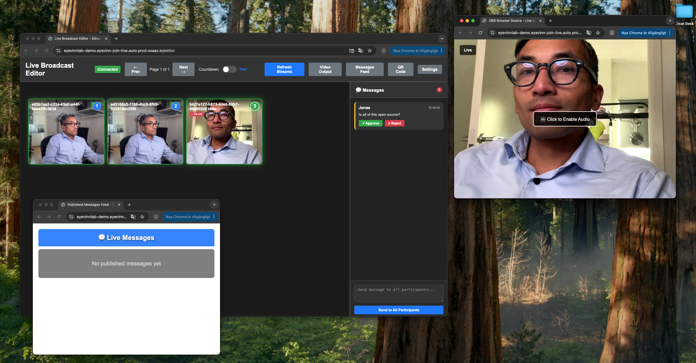

# Join Live

[](https://opensource.org/licenses/Apache-2.0)
[](https://nodejs.org)
[](https://docker.com)

A comprehensive web application for live broadcasting that enables participants to join live streams via WHIP (WebRTC-HTTP Ingestion Protocol) with a professional editor interface for stream management and OBS Studio integration.

## Screenshots

### Participant Interface
<div align="center">
  
  <p><em>Desktop participant interface with camera preview and broadcasting controls</em></p>
</div>

<div align="center">
  
  <p><em>Mobile-responsive participant interface</em></p>
</div>

### On-Air Status
<div align="center">
  
  <p><em>Real-time on-air indicator when participant is selected in editor</em></p>
</div>

### Editor Interface
<div align="center">
  
  <p><em>Professional editor interface with numbered stream mosaic and active output selection</em></p>
</div>

## Features

### 🎥 **Participant Broadcasting**
- 📹 Camera preview with automatic permission handling
- 🔴 One-click live broadcasting via WHIP
- 📱 Responsive design for desktop and mobile
- 🎛️ Real-time status updates

### 🎛️ **Professional Editor Interface**
- 📺 Numbered stream mosaic view
- ⌨️ Keyboard shortcuts (1-9, 0) for instant stream selection
- 🔄 Real-time synchronization across all devices
- 📊 Live stream monitoring and management

### 🎮 **OBS Studio Integration**
- 🖥️ **Screen/Window Capture**: Capture participant video feed for broadcast output
- 🌐 **Browser Source**: Clean video output (`/source`) and QR code display (`/qr`)
- 🔄 Automatic stream switching based on editor selection
- 📡 Real-time updates via WebSocket
- 📱 QR code display for easy participant joining

### 🔧 **Technical Features**
- ⚙️ Configurable WHIP/WHEP gateways
- 🐳 Docker containerization
- 🔐 Authentication support
- 🌍 Environment-based configuration

## 🚀 Try it Now on Open Source Cloud

**Want to try Join Live immediately without any setup?** 

Launch it instantly on Open Source Cloud (OSC) - a platform that provides managed WebRTC infrastructure and open source services:

**👉 [Launch Join Live on OSC](https://app.osaas.io/browse/eyevinn-join-live)**

OSC provides:
- ✅ **Pre-configured WebRTC gateways** (WHIP/WHEP) - no setup required
- ✅ **Managed infrastructure** - just click and start broadcasting
- ✅ **All WebRTC components included** - Symphony Media Bridge, WHIP Bridge, WHEP Gateway
- ✅ **Instant deployment** - ready to use in seconds

Perfect for testing, demos, or production use without the complexity of setting up WebRTC infrastructure.

---

## Quick Start

### Using Docker (Recommended)

1. **Build and run with Docker Compose:**
   ```bash
   docker-compose up --build
   ```

2. **Or build and run manually:**
   ```bash
   docker build -t join-live .
   docker run -p 3000:3000 join-live
   ```

3. **With custom gateway URLs:**
   ```bash
   docker run -p 3000:3000 \
     -e WHIP_GATEWAY_URL=your-whip-gateway \
     -e WHEP_GATEWAY_URL=your-whep-gateway \
     -e WHIP_AUTH_KEY=your-whip-auth-key \
     join-live
   ```

### Using Node.js directly

1. **Install dependencies:**
   ```bash
   npm install
   ```

2. **Start the application:**
   ```bash
   npm start
   ```

3. **Open your browser:**
   Navigate to `http://localhost:3000`

### Application Views

- **Participant View** (`/join`): Camera access and live streaming
- **Editor View** (`/editor`): Stream management with numbered mosaic and keyboard shortcuts
- **OBS Browser Source** (`/source`): Clean video output for OBS Studio Browser Source
- **QR Code Display** (`/qr`): QR code for participant joining, ideal for OBS Browser Source

### Using the Application

1. **Join as Participant:**
   - Visit `http://localhost:3000/join`
   - Click "Start Camera" to preview your video
   - Click "Join Live" to start broadcasting
   - Click "Stop Streaming" to end the broadcast

2. **Editor Interface:**
   - Visit `http://localhost:3000/editor`
   - View numbered mosaic of all active streams
   - Press number keys `1-9` (and `0` for 10th stream) to select streams
   - Selected stream is synchronized across all devices

3. **OBS Integration:**
   
   **For Video Output:**
   - Use **Screen Capture** (or **Window Capture**) in OBS to capture the participant's video feed
   - The selected participant's video will be displayed full-screen based on editor selection
   - Alternatively, add `http://localhost:3000/source` as **Browser Source** for a clean output
   
   **For QR Code Display:**
   - Add `http://localhost:3000/qr` as **Browser Source** in OBS
   - QR code will display the join URL for participants to scan and join

## Configuration

### WHIP Gateway URL

To configure a WHIP gateway, provide the base URL (the `/api/v2/whip/sfu-broadcaster` endpoint path is added automatically):

**Option 1: Environment Variable**
```bash
WHIP_GATEWAY_URL=https://your-whip-gateway.com npm start
```

**Option 2: .env file**
```bash
cp .env.example .env
# Edit .env and set your WHIP_GATEWAY_URL (base URL only)
```

### WHEP Gateway URL

The application uses WHEP (WebRTC-HTTP Egress Protocol) for viewing streams in the editor and OBS source. By default, it uses the same gateway as WHIP, but you can configure a separate WHEP gateway:

**Option 1: Environment Variable**
```bash
WHEP_GATEWAY_URL=https://your-whep-gateway.com npm start
```

**Option 2: .env file**
```bash
cp .env.example .env
# Edit .env and set your WHEP_GATEWAY_URL (base URL only)
```

### WHIP Authentication

If your WHIP gateway requires authentication, set the auth key:

**Option 1: Environment Variable**
```bash
WHIP_AUTH_KEY=your-auth-key npm start
```

**Option 2: .env file**
```bash
cp .env.example .env
# Edit .env and set your WHIP_AUTH_KEY
```

**Combined Example:**
```bash
WHIP_GATEWAY_URL=https://your-whip-gateway.com \
WHEP_GATEWAY_URL=https://your-whep-gateway.com \
WHIP_AUTH_KEY=secret123 \
npm start
```

### Port Configuration

```bash
PORT=8080 npm start  # Run on port 8080 instead of 3000
```

## Docker Scripts

Available npm scripts for Docker:

```bash
npm run docker:build           # Build Docker image
npm run docker:run             # Run Docker container
npm run docker:run-dev         # Run with development environment
npm run docker:compose         # Start with docker-compose
npm run docker:compose-build   # Build and start with docker-compose
npm run docker:compose-down    # Stop docker-compose services
```

## Technical Details

### Dependencies

- **@eyevinn/whip-web-client**: Open source WHIP client library
- **express**: Web server for serving the application

### WebRTC Configuration

The application requests camera and microphone access with these settings:
- Video: 1280x720 resolution (ideal)
- Audio: Default microphone
- Camera: Front-facing (user) camera preferred

### WHIP Integration

Uses the Symphony Media Bridge WHIP gateway for ingesting WebRTC streams. The application automatically appends `/api/v2/whip/sfu-broadcaster` to the base gateway URL.

## Browser Support

- Chrome 88+
- Firefox 84+
- Safari 14+
- Edge 88+

## Troubleshooting

### Camera Access Issues
- Ensure you're accessing the app via HTTPS in production
- Check browser permissions for camera/microphone access
- Some browsers require user interaction before requesting media access

### Connection Issues
- Verify the WHIP/WHEP gateway URLs are correct and accessible
- Check network connectivity and firewall settings
- Ensure the WHIP/WHEP gateways support the required WebRTC codecs
- Verify authentication keys are correct for the WHIP gateway

### Development
For development with HTTPS (required for camera access on remote devices):
```bash
# Use a tool like ngrok for HTTPS tunneling
npx ngrok http 3000
```

## Contributing

We welcome contributions! Please see [CONTRIBUTING.md](CONTRIBUTING.md) for guidelines on how to contribute to this project.

## Support

- 📖 [Documentation](https://github.com/Eyevinn/join-live#readme)
- 🐛 [Issue Tracker](https://github.com/Eyevinn/join-live/issues)
- 💬 [Discussions](https://github.com/Eyevinn/join-live/discussions)
- 🚀 [Try on Open Source Cloud](https://app.osaas.io/browse/eyevinn-join-live)

## About Eyevinn Technology

[Eyevinn Technology](https://www.eyevinn.se) is an independent consultant firm specialized in video and streaming. Independent in a way that we are not commercially tied to any platform or technology vendor. As our way to innovate and push the industry forward we develop proof-of-concepts and tools. The things we learn and the code we write we share with the industry in [blogs](https://dev.to/video) and by open sourcing the code we have written.

Want to know more about Eyevinn and how it is to work here? Contact us at work@eyevinn.se!

## License

This project is licensed under the Apache License 2.0 - see the [LICENSE](LICENSE) file for details.

```
Copyright 2025 Eyevinn Technology AB

Licensed under the Apache License, Version 2.0 (the "License");
you may not use this file except in compliance with the License.
You may obtain a copy of the License at

    http://www.apache.org/licenses/LICENSE-2.0

Unless required by applicable law or agreed to in writing, software
distributed under the License is distributed on an "AS IS" BASIS,
WITHOUT WARRANTIES OR CONDITIONS OF ANY KIND, either express or implied.
See the License for the specific language governing permissions and
limitations under the License.
```