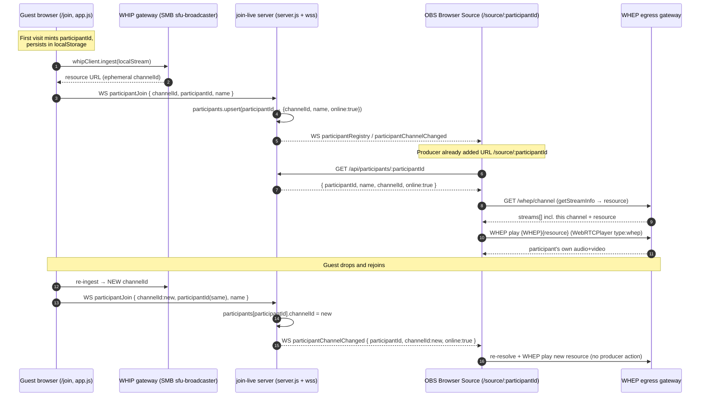

# Spec: Per-Participant Individual Outputs

- **Issue:** Eyevinn/join-live#9 ("multiple participants output")
- **Status:** Draft for review (Phase 1 spec — implementation not included)
- **Scope:** `join-live` only (single-repo frontend feature)
- **Author:** architect agent

---

## 1. Problem statement

Today `join-live` produces exactly **one** program output. `source.html` (served at
`/source`) is an editor-driven page that renders whatever the editor has selected: a single
participant, or a client-side **side-by-side mosaic** of up to two participants
(`switchToStream` / `switchToMultipleStreams`, painting into `videoElement` and
`videoElement2`). There is no way to obtain an independent, stable output URL for a *single*
named participant.

Live producers need the opposite: **one clean, individually-addressable output per
participant**, each usable as its own OBS Browser Source, so they can switch, crop, overlay,
and audio-mix each guest independently in their vision mixer. The mosaic is a composited
convenience layout; it removes the per-guest control that professional workflows depend on.

**Goal:** expose each active participant as an independent output endpoint that OBS (or any
Browser Source consumer) can load by URL, carrying that participant's own video and audio only,
and remaining valid across the participant's reconnects.

**Non-goals:** server-side compositing/transcoding, changing the WHIP ingest path, replacing
the existing editor mosaic (it stays as a backward-compatible option), and any change to the
messaging/moderation subsystem.

---

## 2. API / endpoint design

### 2.1 Current relevant surface (grounding)

| Route (in `server.js`) | Serves |
|---|---|
| `GET /join` | `index.html` (participant, `app.js`) |
| `GET /editor` | `editor.html` (`editor.js`) |
| `GET /source` | `source.html` — editor-driven single/mosaic output |
| `GET /config.js` | injects `window.WHIP_GATEWAY_URL`, `window.WHIP_AUTH_KEY`, `window.WHEP_GATEWAY_URL`, `window.WHEP_AUTH_KEY` |

Playback today resolves a channel through the WHEP gateway: `getStreamInfo(channelId)` does
`GET {WHEP_GATEWAY}/whep/channel`, finds the entry whose
`channelId || id || streamId || channel` matches, reads its `resource`, and plays
`{WHEP_GATEWAY}{resource}` (fallback `{WHEP_GATEWAY}/whep/{channelId}`) via
`@eyevinn/webrtc-player` with `type: 'whep'`.

### 2.2 New endpoints

**Render page (the OBS Browser Source URL):**

```
GET /source/:participantId
```

- Serves a new static page `source-single.html` (a trimmed sibling of `source.html`).
- The page reads `:participantId` from `window.location.pathname` and is **pinned** to that one
  participant. Unlike `/source`, it does **not** react to editor `selectChannel` events — the
  producer, not the editor, decides what each Browser Source shows.
- Query params:
  - `?audio=0` — mute the source (video-only). Default is audio **on** (see §5).
  - `?overlay=0` — suppress the built-in name/label overlay (default per §7 open question).
- Backward compatibility: the existing `/source` (mosaic) route is unchanged.

**Registry resolution API (server-side, JSON):**

```
GET /api/participants
GET /api/participants/:participantId
```

- `GET /api/participants` → `200` `{ "participants": [ParticipantView, ...] }`
- `GET /api/participants/:participantId` → `200 ParticipantView`, or `404 { "error": "unknown participant" }`

```jsonc
// ParticipantView
{
  "participantId": "p_5f3c...",   // server-minted, stable across reconnects (§3)
  "name": "Alex",                 // display name from the join form, may be ""
  "channelId": "abcd1234",        // CURRENT ephemeral WHIP-gateway channel, or null if offline
  "online": true,                 // has a live channel right now
  "joinedAt": "2026-09-24T10:00:00.000Z",
  "lastSeen": "2026-09-24T10:05:00.000Z"
}
```

The render page uses `channelId` from this view exactly as `source.html` does today
(`getStreamInfo` → `resource` → WHEP playback). It never hard-codes a channel; it always
resolves `participantId → channelId` first, so a reconnect that mints a new `channelId`
transparently reconnects the output (§3, §6).

### 2.3 WebSocket additions (`server.js` `wss`)

Reusing the existing broadcast pattern over `connectedClients`:

| `type` (client→server) | Payload | Effect |
|---|---|---|
| `participantJoin` *(extended)* | `{ channelId, participantId, name }` | register/refresh registry entry (§3) |
| `participantLeave` *(extended)* | `{ channelId, participantId }` | mark entry `online:false` |

| `type` (server→clients) | Payload | Consumed by |
|---|---|---|
| `participantRegistry` | `{ participants: [ParticipantView, ...] }` | render page (initial state on WS open) + editor |
| `participantChannelChanged` | `{ participantId, channelId, online }` | render page re-subscribes to the new channel |

`participantChannelChanged` is what makes `/source/:participantId` durable: when a guest
reconnects and the WHIP gateway assigns a new `channelId`, the server updates the registry and
pushes this event; the pinned render page tears down its `WebRTCPlayer` and loads the new WHEP
resource without the producer touching OBS.

---

## 3. Data / model — stable participant identity

**Problem in today's code:** the only identifier is `channelId`, and it is minted by the WHIP
gateway per ingest. In `app.js`, after `whipClient.ingest(...)`, the id is scraped from
`getResourceUrl()` with `resourceUrl.match(/\/([^\/]+)$/)`. A drop + rejoin produces a **new**
`channelId`, so any URL keyed on `channelId` would silently break on reconnect. There is no
name↔channel binding either — the join form's name is only used for chat messages today.

**Decision — server-side registry keyed by a client-persisted stable id:**

1. **`participantId` is minted client-side and persisted.** On first load of `/join`, `app.js`
   generates `participantId = "p_" + crypto.randomUUID()` and stores it in
   `localStorage['joinlive_participantId']`. Subsequent loads (including reconnects) reuse it.
   Rationale: the browser is the only thing that survives a WHIP-session drop; the server and
   gateway both forget the ephemeral channel. Persisting client-side is the cheapest durable
   anchor and needs no auth/accounts.
2. **`name` is bound at join.** `app.js` already collects a participant name for messaging; the
   same value is sent with `participantJoin` so the registry can label the output.
3. **Server keeps a `participants` Map** (`participantId → { participantId, name, channelId,
   online, joinedAt, lastSeen }`) alongside the existing `participantChannels` Set. On
   `participantJoin` it upserts the entry and sets `channelId`/`online:true`; on
   `participantLeave` (or WS `close`) it sets `online:false` and clears `channelId` but **keeps
   the entry** so the id/name survive a reconnect. Entries older than a TTL (e.g. 30 min
   offline) are garbage-collected.
4. **Resolution is always `participantId → current channelId`.** Render page and editor read
   the registry; nothing else stores a channel long-term.

This is purely additive: `channelId` remains the media-plane key the gateway understands;
`participantId` is the new stable control-plane key that maps onto it.

---

## 4. Rendering model — direct WHEP vs. re-composite

**Decision: direct WHEP subscription, one WHEP resource per participant. No re-compositing.**

Rationale, grounded in the current code and topology:

- The participant's media is already ingested as an **independent SFU broadcaster channel**
  (`/api/v2/whip/sfu-broadcaster` on the SMB WHIP bridge) and the WHEP egress already exposes
  **each channel individually** — `source.html` plays exactly one channel per `<video>` via
  `{WHEP_GATEWAY}{resource}`. The per-participant stream is therefore *already directly
  subscribable*; only the client-side layout bundles two of them together.
- The existing mosaic is composited **in the browser** (two `WebRTCPlayer` instances into two
  video elements), not on a server. So "one output per participant" is achieved simply by
  running **one player, pinned to one channel, per page** — no new media component.
- Re-compositing (a server-side mixer / additional egress that renders one output per guest)
  would add an entire media component that does not exist today, plus a transcode/latency hop,
  extra egress cost per output, and an operational failure surface — to reproduce a stream the
  gateway already emits. There is no benefit; per-guest crop/overlay is done in OBS, not by
  join-live.

Therefore `/source/:participantId` resolves the participant's current `channelId`, then reuses
the **exact** existing playback path (`getStreamInfo` → `resource` → `WebRTCPlayer` with
`type:'whep'`) for that single channel. This keeps the media plane identical to today and
confines the change to routing + identity.

---

## 5. Per-participant audio handling

Because each output is a **direct WHEP subscription to one SFU broadcaster channel**, it
carries **only that participant's own audio track** — audio isolation is a property of the
topology, not something we must build. This is exactly the per-guest audio producers asked for.

Decisions:

- **Audio on by default.** `/source/:participantId` plays the participant's audio so each OBS
  Browser Source is a complete audio+video feed the producer can route/mix per guest.
- **`?audio=0` opt-out.** Producers who prefer to take audio from a separate path (or who add
  the same source twice — once muted for video, once for audio) can mute per URL. Implemented by
  muting the `<video>` element / not requesting the audio track for playback; the WHEP
  subscription itself is unchanged.
- **Autoplay:** the page must satisfy browser autoplay policy for audible playback. OBS's CEF
  Browser Source autoplays audio by default; for regular browsers the page starts muted and
  unmutes on first user gesture — same constraint the current `source.html` already lives with.
- **Legacy `/source` mosaic** keeps mixing both channels' audio as it does today; it is untouched.

---

## 6. Sequence diagram



---

## 7. Open questions (for the product owner)

These are genuine product/UX trade-offs, not technical gaps. Every technical choice above is
decided.

- **Default overlay content.** Should `/source/:participantId` render *clean* (no name/label,
  producer adds their own lower-third) or show a built-in name overlay by default, with
  `?overlay=0` to hide? Broadcast convention leans clean; ease-of-use leans labelled. Product
  call. *(Endpoint supports either via `?overlay=`.)*
- **Fate of the legacy side-by-side `/source` mosaic.** Keep indefinitely, mark deprecated in
  docs, or eventually remove once per-participant outputs land? Affects docs/UX messaging.
- **Showing guest display-names to producers / in `/api/participants`.** Names come from the
  join form and would surface in the editor list and API. Is exposing/persisting guest names a
  privacy concern for your deployments, or expected? (Fallback to an anonymous
  `Guest N` label is trivial if names should not be surfaced.)
- **Officially supported concurrent output count.** How many simultaneous per-participant WHEP
  outputs should we document as supported? This sets an expectation on WHEP-egress
  scaling/cost. Engineering can supply limits; the *target* is a product/ops decision.
- **Reconnect trust.** Reusing a `localStorage` `participantId` means a returning browser
  auto-reclaims its output URL with no re-approval. Is silent reclaim the desired behaviour, or
  should a producer re-admit a returning guest? (A confirm-on-reconnect flow is a small
  addition if wanted; left out by default for zero-friction rejoin.)
```
